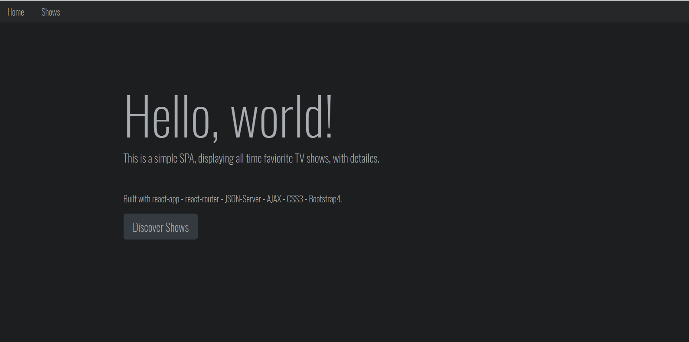

This project was developed with create-react-app

# Screenshots

  
  
  

## Feel free to clone or download
After downloading and prior running the app you need to run these commands  
'npm init'  
'npm install'  
# Prerequisite
## Dependencies:
react-router-dom  
@material-ui/core && @material-ui/icons  

### JSON Server
Install json-server and start the server with this command  
'npm install json-server'  
Create your JSON file [or use the one I shared ] and run  
'json-server --watch fileName.json'
You can specify the port number by adding this command at the end  
'--port 3004' 

# Run the app
You can run the app after you started your json server with the appropriate JSON file  
'npm start'  
The appliction will start on port 3000  
Please update the port number in the fecth call url to be the same as json-server

